# Agency Engine

> A full-service digital agency built for solo founders and 1-3 person teams who want to operate like a 20-person agency on retainer math.

## Overview

| Field | Value |
| --- | --- |
| Tags | — |
| Tone | `green` |
| Agents | 19 |
| Projects | 2 |
| Tasks | 5 |
| Goals | 3 |
| Skills | 14 |

## Org Chart

```mermaid
graph TD
  account-manager["Account Manager — Account Manager"]
  analyst["Analyst — Analyst"]
  bookkeeper["Bookkeeper — Bookkeeper"]
  brand-designer["Brand Designer — Brand Designer"]
  ceo["CEO — CEO"]
  copywriter["Copywriter — Copywriter"]
  creative-director["Creative Director — Creative Director"]
  director-of-operations["Director of Operations — Director of Operations"]
  finance-controller["Finance Controller — Finance Controller"]
  head-of-accounts["Head of Accounts — Head of Accounts"]
  lifecycle-email-lead["Lifecycle/Email Lead — Lifecycle/Email Lead"]
  market-researcher["Market Researcher — Market Researcher"]
  paid-media-lead["Paid Media Lead — Paid Media Lead"]
  project-manager["Project Manager — Project Manager"]
  reporting-engineer["Reporting Engineer — Reporting Engineer"]
  seo-lead["SEO Lead — SEO Lead"]
  social-lead["Social Lead — Social Lead"]
  strategist["Strategist — Strategist"]
  video-editor["Video Editor — Video Editor"]
  head-of-accounts --> account-manager
  director-of-operations --> analyst
  director-of-operations --> bookkeeper
  creative-director --> brand-designer
  creative-director --> copywriter
  ceo --> creative-director
  ceo --> director-of-operations
  ceo --> finance-controller
  ceo --> head-of-accounts
  ceo --> lifecycle-email-lead
  strategist --> market-researcher
  ceo --> paid-media-lead
  head-of-accounts --> project-manager
  director-of-operations --> reporting-engineer
  ceo --> seo-lead
  ceo --> social-lead
  ceo --> strategist
  creative-director --> video-editor
```

## Agents

- **[Account Manager](agents/account-manager/AGENTS.md)** — Account Manager
- **[Analyst](agents/analyst/AGENTS.md)** — Analyst
- **[Bookkeeper](agents/bookkeeper/AGENTS.md)** — Bookkeeper
- **[Brand Designer](agents/brand-designer/AGENTS.md)** — Brand Designer
- **[CEO](agents/ceo/AGENTS.md)** — CEO
- **[Copywriter](agents/copywriter/AGENTS.md)** — Copywriter
- **[Creative Director](agents/creative-director/AGENTS.md)** — Creative Director
- **[Director of Operations](agents/director-of-operations/AGENTS.md)** — Director of Operations
- **[Finance Controller](agents/finance-controller/AGENTS.md)** — Finance Controller
- **[Head of Accounts](agents/head-of-accounts/AGENTS.md)** — Head of Accounts
- **[Lifecycle/Email Lead](agents/lifecycle-email-lead/AGENTS.md)** — Lifecycle/Email Lead
- **[Market Researcher](agents/market-researcher/AGENTS.md)** — Market Researcher
- **[Paid Media Lead](agents/paid-media-lead/AGENTS.md)** — Paid Media Lead
- **[Project Manager](agents/project-manager/AGENTS.md)** — Project Manager
- **[Reporting Engineer](agents/reporting-engineer/AGENTS.md)** — Reporting Engineer
- **[SEO Lead](agents/seo-lead/AGENTS.md)** — SEO Lead
- **[Social Lead](agents/social-lead/AGENTS.md)** — Social Lead
- **[Strategist](agents/strategist/AGENTS.md)** — Strategist
- **[Video Editor](agents/video-editor/AGENTS.md)** — Video Editor

## Goals

- **$30K MRR in agency retainers within 90 days of import**: 
- **8 active retainer clients with 85%+ gross retention at 12 months**: 
- **Plan -> Run -> Report cadence honored every cycle, every client**: 

## Projects

- **[Client #1 Onboarding and First Retainer Cycle](projects/client-1-onboarding-first-cycle/PROJECT.md)**
- **[Retainer Pitch Engine and First 3 Outbound Deals](projects/retainer-pitch-engine-first-3-deals/PROJECT.md)**
