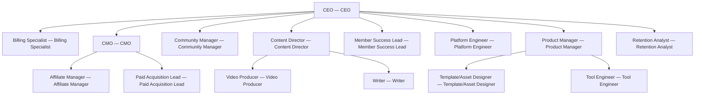

# Membership Stack

> A recurring digital-product membership operator that bundles templates, tools, content, and community into one subscription for solo operators and small-team buyers.

## Overview

| Field | Value |
| --- | --- |
| Tags | — |
| Tone | `green` |
| Agents | 15 |
| Projects | 2 |
| Tasks | 6 |
| Goals | 3 |
| Skills | 11 |

## Org Chart

## Agents

- **[Affiliate Manager](agents/affiliate-manager/AGENTS.md)** — Affiliate Manager
- **[Billing Specialist](agents/billing-specialist/AGENTS.md)** — Billing Specialist
- **[CEO](agents/ceo/AGENTS.md)** — CEO
- **[CMO](agents/cmo/AGENTS.md)** — CMO
- **[Community Manager](agents/community-manager/AGENTS.md)** — Community Manager
- **[Content Director](agents/content-director/AGENTS.md)** — Content Director
- **[Member Success Lead](agents/member-success-lead/AGENTS.md)** — Member Success Lead
- **[Paid Acquisition Lead](agents/paid-acquisition-lead/AGENTS.md)** — Paid Acquisition Lead
- **[Platform Engineer](agents/platform-engineer/AGENTS.md)** — Platform Engineer
- **[Product Manager](agents/product-manager/AGENTS.md)** — Product Manager
- **[Retention Analyst](agents/retention-analyst/AGENTS.md)** — Retention Analyst
- **[Template/Asset Designer](agents/template-asset-designer/AGENTS.md)** — Template/Asset Designer
- **[Tool Engineer](agents/tool-engineer/AGENTS.md)** — Tool Engineer
- **[Video Producer](agents/video-producer/AGENTS.md)** — Video Producer
- **[Writer](agents/writer/AGENTS.md)** — Writer

## Goals

- **$25K MRR with under 8% monthly churn within 90 days**: 
- **50+ launchable assets in the library within 90 days**: 
- **Annual pricing live and affiliate program v1 driving 20%+ of new MRR**: 

## Projects

- **[Annual pricing flip + churn-save sequence](projects/annual-pricing-flip-and-churn-save-sequence/PROJECT.md)**
- **[Library v1: 20 assets + onboarding tour](projects/library-v1-20-assets-onboarding-tour/PROJECT.md)**
