# Niche Site Empire

> Operator-led portfolio of programmatic SEO and affiliate content sites — kill ruthlessly, scale winners.

## Overview

| Field | Value |
| --- | --- |
| Tags | — |
| Tone | `green` |
| Agents | 16 |
| Projects | 2 |
| Tasks | 6 |
| Goals | 3 |
| Skills | 13 |

## Org Chart

```mermaid
graph TD
  affiliate-disclosures-compliance["Affiliate Disclosures Compliance — Affiliate Disclosures Compliance"]
  affiliate-program-manager["Affiliate Program Manager — Affiliate Program Manager"]
  ceo["CEO / Portfolio Owner — CEO / Portfolio Owner"]
  content-director["Content Director — Content Director"]
  digital-pr-lead["Digital PR Lead — Digital PR Lead"]
  display-ads-manager["Display Ads Manager (Ezoic/Mediavine/AdThrive) — Display Ads Manager (Ezoic/Mediavine/AdThrive)"]
  domain-acquirer["Domain Acquirer — Domain Acquirer"]
  editor["Editor — Editor"]
  link-acquisition-lead["Link Acquisition Lead — Link Acquisition Lead"]
  niche-researcher["Niche Researcher — Niche Researcher"]
  schema-specialist["Schema/Structured Data Specialist — Schema/Structured Data Specialist"]
  seo-analyst["SEO Analyst — SEO Analyst"]
  site-speed-engineer["Site Speed Engineer — Site Speed Engineer"]
  sponsored-content-manager["Sponsored Content Manager — Sponsored Content Manager"]
  technical-seo-lead["Technical SEO Lead — Technical SEO Lead"]
  writers-lead["Writers Lead — Writers Lead"]
  content-director --> affiliate-disclosures-compliance
  ceo --> affiliate-program-manager
  ceo --> content-director
  link-acquisition-lead --> digital-pr-lead
  ceo --> display-ads-manager
  ceo --> domain-acquirer
  content-director --> editor
  ceo --> link-acquisition-lead
  ceo --> niche-researcher
  technical-seo-lead --> schema-specialist
  ceo --> seo-analyst
  technical-seo-lead --> site-speed-engineer
  ceo --> sponsored-content-manager
  ceo --> technical-seo-lead
  content-director --> writers-lead
```

## Agents

- **[Affiliate Disclosures Compliance](agents/affiliate-disclosures-compliance/AGENTS.md)** — Affiliate Disclosures Compliance
- **[Affiliate Program Manager](agents/affiliate-program-manager/AGENTS.md)** — Affiliate Program Manager
- **[CEO / Portfolio Owner](agents/ceo/AGENTS.md)** — CEO / Portfolio Owner
- **[Content Director](agents/content-director/AGENTS.md)** — Content Director
- **[Digital PR Lead](agents/digital-pr-lead/AGENTS.md)** — Digital PR Lead
- **[Display Ads Manager (Ezoic/Mediavine/AdThrive)](agents/display-ads-manager/AGENTS.md)** — Display Ads Manager (Ezoic/Mediavine/AdThrive)
- **[Domain Acquirer](agents/domain-acquirer/AGENTS.md)** — Domain Acquirer
- **[Editor](agents/editor/AGENTS.md)** — Editor
- **[Link Acquisition Lead](agents/link-acquisition-lead/AGENTS.md)** — Link Acquisition Lead
- **[Niche Researcher](agents/niche-researcher/AGENTS.md)** — Niche Researcher
- **[Schema/Structured Data Specialist](agents/schema-specialist/AGENTS.md)** — Schema/Structured Data Specialist
- **[SEO Analyst](agents/seo-analyst/AGENTS.md)** — SEO Analyst
- **[Site Speed Engineer](agents/site-speed-engineer/AGENTS.md)** — Site Speed Engineer
- **[Sponsored Content Manager](agents/sponsored-content-manager/AGENTS.md)** — Sponsored Content Manager
- **[Technical SEO Lead](agents/technical-seo-lead/AGENTS.md)** — Technical SEO Lead
- **[Writers Lead](agents/writers-lead/AGENTS.md)** — Writers Lead

## Goals

- **Portfolio earning $20K/month across 5+ sites within 90 days**: 
- **8 active sites with 5 clearing $4K/month each within 12 months**: 
- **Two sites qualified for premium ad networks (Mediavine or AdThrive) within 12 months**: 

## Projects

- **[Hero Site Keyword Cluster + First 40 Articles](projects/hero-site-keyword-cluster-launch/PROJECT.md)**
- **[Mediavine Qualification Gate](projects/mediavine-qualification-gate/PROJECT.md)**
