# SEO Bureau

> Productized SEO retainer shop for SMB and mid-market clients — technical SEO, content, link acquisition, and white-label reporting.

## Overview

| Field | Value |
| --- | --- |
| Tags | — |
| Tone | `green` |
| Agents | 15 |
| Projects | 2 |
| Tasks | 6 |
| Goals | 3 |
| Skills | 12 |

## Org Chart

```mermaid
graph TD
  account-manager["Account Manager — Account Manager"]
  bd-sales-lead["BD/Sales Lead — BD/Sales Lead"]
  ceo["CEO — CEO"]
  client-reporting-manager["Client Reporting Manager — Client Reporting Manager"]
  content-strategist["Content Strategist — Content Strategist"]
  crawl-render-specialist["Crawl & Render Specialist — Crawl & Render Specialist"]
  digital-pr-specialist["Digital PR Specialist — Digital PR Specialist"]
  editor["Editor — Editor"]
  head-of-accounts["Head of Accounts — Head of Accounts"]
  link-acquisition-lead["Link Acquisition Lead — Link Acquisition Lead"]
  reporting-engineer["Reporting Engineer — Reporting Engineer"]
  schema-implementation-specialist["Schema Implementation Specialist — Schema Implementation Specialist"]
  seo-analyst["SEO Analyst — SEO Analyst"]
  seo-writer["SEO Writer — SEO Writer"]
  tech-seo-lead["Tech SEO Lead — Tech SEO Lead"]
  head-of-accounts --> account-manager
  ceo --> bd-sales-lead
  head-of-accounts --> client-reporting-manager
  ceo --> content-strategist
  tech-seo-lead --> crawl-render-specialist
  link-acquisition-lead --> digital-pr-specialist
  content-strategist --> editor
  ceo --> head-of-accounts
  ceo --> link-acquisition-lead
  ceo --> reporting-engineer
  tech-seo-lead --> schema-implementation-specialist
  ceo --> seo-analyst
  content-strategist --> seo-writer
  ceo --> tech-seo-lead
```

## Agents

- **[Account Manager](agents/account-manager/AGENTS.md)** — Account Manager
- **[BD/Sales Lead](agents/bd-sales-lead/AGENTS.md)** — BD/Sales Lead
- **[CEO](agents/ceo/AGENTS.md)** — CEO
- **[Client Reporting Manager](agents/client-reporting-manager/AGENTS.md)** — Client Reporting Manager
- **[Content Strategist](agents/content-strategist/AGENTS.md)** — Content Strategist
- **[Crawl & Render Specialist](agents/crawl-render-specialist/AGENTS.md)** — Crawl & Render Specialist
- **[Digital PR Specialist](agents/digital-pr-specialist/AGENTS.md)** — Digital PR Specialist
- **[Editor](agents/editor/AGENTS.md)** — Editor
- **[Head of Accounts](agents/head-of-accounts/AGENTS.md)** — Head of Accounts
- **[Link Acquisition Lead](agents/link-acquisition-lead/AGENTS.md)** — Link Acquisition Lead
- **[Reporting Engineer](agents/reporting-engineer/AGENTS.md)** — Reporting Engineer
- **[Schema Implementation Specialist](agents/schema-implementation-specialist/AGENTS.md)** — Schema Implementation Specialist
- **[SEO Analyst](agents/seo-analyst/AGENTS.md)** — SEO Analyst
- **[SEO Writer](agents/seo-writer/AGENTS.md)** — SEO Writer
- **[Tech SEO Lead](agents/tech-seo-lead/AGENTS.md)** — Tech SEO Lead

## Goals

- **Reach $25K MRR in retainers within 90 days with <10% monthly client churn**: 
- **Ship the audit, ongoing, and recovery productized tiers end-to-end**: 
- **Stand up white-label monthly reporting on the first business day of every cycle**: 

## Projects

- **[Client 1 Technical Audit + Content Cluster Plan](projects/client-1-technical-audit-content-cluster-plan/PROJECT.md)**
- **[Link Acquisition + Digital PR Sprint](projects/link-acquisition-digital-pr-sprint/PROJECT.md)**
